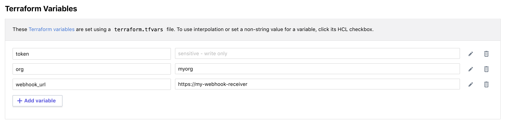

# tfe-workspace-notifications

## Enterprise Benefits

Infrastructure as Code with Terraform allows organizations to specify every piece of infrastructure
that needs to be built in a technology agnostic language that is both developer, and non-developer
friendly.  Terraform Enterprise introduces a policy as code framework, and a basic workflow for
overrides and approvals common in most organizations.

Terraform Enterprise also provides a [notification framework](https://www.terraform.io/docs/cloud/workspaces/notifications.html) that
is useful for integrating into other enterprise systems (CMDB, ITSM, etc.)

Terraform Cloud can use Webhooks to notify external systems about the progress of runs. Each workspace has its own notification settings, and can notify up to 20 destinations.

additionally the webhooks themselves may in turn

## Sample Use cases

* Integration with ITSM (open a ticket, close a ticket, etc)
* Updating CMDB (IP's, hostnames, etc)
* Configuration of external monitoring tools
* Combined with the [northbound REST API](https://www.terraform.io/docs/cloud/api/index.html) to integrate with CI/CD pipelines

# Getting Started

* Fork this repo  
* [Create a Terraform workspace](https://www.terraform.io/docs/cloud/workspaces/creating.html) for your fork
* [Create Variables](https://www.terraform.io/docs/cloud/workspaces/variables.html) to define your token, organization and webhook url

  

* Queue Plan!
